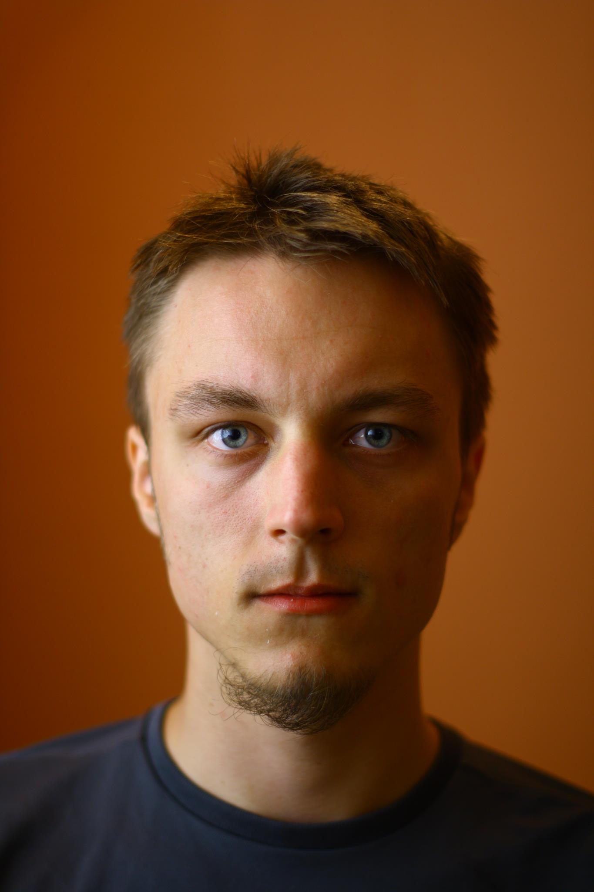

My name is Michal Staniaszek. I'm a student of robotics and artificial
intelligence currently based in Birmingham, UK. My undergraduate degree in
Computer Science was completed at the University of Birmingham where I also
co-founded the
[Birmingham Autonomous Robotics Club](http://barcuk.github.io/index.html). I
spent my third year at Keio university in Tokyo, Japan, where I studied Japanese
language. From August 2013, I will be at the Royal Institute of Technology in
Stockholm, Sweden, studying for a master's degree in Systems, Control and
Robotics.

I currently speak English, Polish and Japanese fluently, and have basic
knowledge of French, German and Swedish. I learn natural languages for fun. I'm
also fluent in C, Java and Python. I learn machine languages whenever I need
them.

My academic interests lie somewhere within the fields of machine learning and
robotics. I'd like create robots with something that at least vaguely resembles
human-level intelligence.

You can find a printable CV
[here](https://github.com/heuristicus/cv/blob/master/cv.pdf?raw=true), or for a
web-based version, see my
[LinkedIn profile](http://www.linkedin.com/profile/view?id=236650527).

I spend most of my free time reading about things that I feel I don't know much
about. I have a particular interest in furthering my understanding of science
and engineering, especially physics and aeronautics. Outside science, I have
some interest in the philosophy of mind, in relation to our understanding of
consciousness, and the philosophy of religion, which is important in both
historical and contemporary contexts. I enjoy reading science fiction for its
exploration of the effects of technological advancement on human society. I have
recently started to read important authors of past few centuries, including
Orwell, Kafka, Darwin and others. I also spend a lot of time reading Japanese
novels and popular science books, both to maintain my language skills and to see
things from a different cultural perspective.

If I don't have my head in a book, I'm usually riding my bicycle. It's almost
got to the point where I don't like walking because it's just too slow.

## Where am I?
You can find me at various places on the internet, including:

- [GitHub](https://github.com/heuristicus) -- Almost all the code I've ever
  written.
- [Twitter](https://twitter.com/MStaniaszek) -- Rarely tweet, sometimes listen.
- [Flickr](http://www.flickr.com/photos/mstaniaszek/) -- Some of my more
  presentable photography.
- [Last.fm](http://www.last.fm/user/nitre) -- It doesn't count if you don't
  scrobble it.

## Contact
The best way to contact me is by email. If you're not a robot, then you
should be able to remove the five uppercase letters in front of the address that
follows.

ROBOTcontact@michalstaniaszek.com

If you can do that and you _are_ a robot, then let me know.
